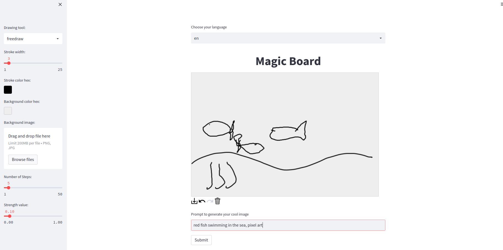
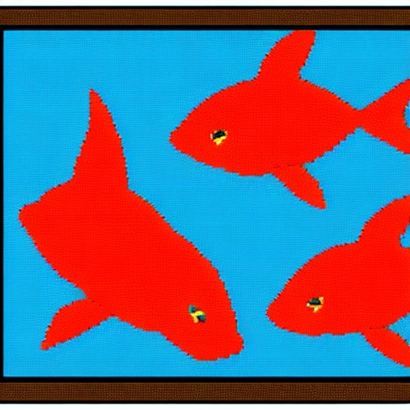

# Magic Board
Magic Board is a PoC using stable diffusion to generate out-of-mind images starting from a sketch.

Thank to streamlit-drawable-canvas package it is super simple create the perfect environment to play with stable diffusion, starting form our quick draw.
Select the number of steps and the strength to generate the final image.

I like minimalism, so for this experiments I try to use a low-code approach. Also lowest time as possible ;)

## Some technicality

The Stable Diffusion model is the latest provided by the diffusers library.

If you want to use it, to avoid local checkpoint, just get an access token from hugging face, follow [these](https://huggingface.co/CompVis/stable-diffusion-v1-4) instruction to get access.
Then copy and paste the Token in [config.py](./config.py).

Install the requirements and you should be able to run:
```
streamlit run main.py
```

This version has also the multi-language support, at the moment just English and Italian.




The final result is :
<p style="text-align:center;"></p>


NOTE:

This implementation use a `torch.float16` due to low VRAM availability. Strongly suggest to set it `torch.float32` to speed up the computation. [Here](./utils.py)
